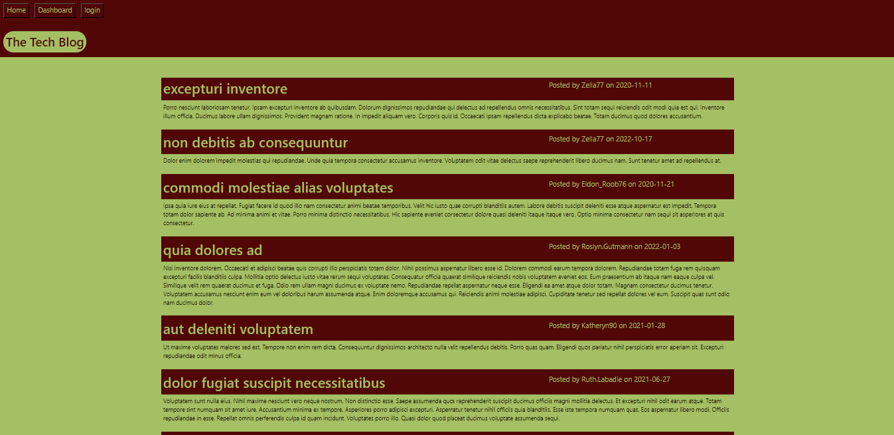

# The Tech Blog Project

## Description

The Tech Blog Project is an application that helps the developers to read and write baout technical concepts, recent advancements, and new technologies. This is a user-friendly app web application. Moreover, this project is about building a CMS-style blog site similar to a Wordpress site, where developers can publish their blog posts and comment on other developers' posts as well.

## Technologies Used

-Handlebars.js
- CSS
- Javascript
- MVC paradigm
- Sequelize
- npm
- Express-session

## Installation

What are the steps required to install your project?
- Provided step by step description on how to get the development of environment running.
- Installed npm using npm init to initiate the npm
- After that, added libraries to package.json like express, express-handlerbars, express-session, mysql2, sequelize.
- Moreover, added devDEpendencies like eslint, eslint-config-prettier, prettier to package.json and run the application with the command npm start.

## Usage

Screenshot of The Tech Blog Project

## Credits

Seeding taken from repo link "https://github.com/femke77/seeds" by cloning to the local machine.

## Links

-URL link for the deployed Github application: https://rudrijoshi.github.io/The-Tech-Blog-Project/

-URL link for the Github repository: https://github.com/rudrijoshi/The-Tech-Blog-Project/

-URL of the functional, heroku deployed application.: https://thawing-harbor-85206-32f8ce9b795f.herokuapp.com/
